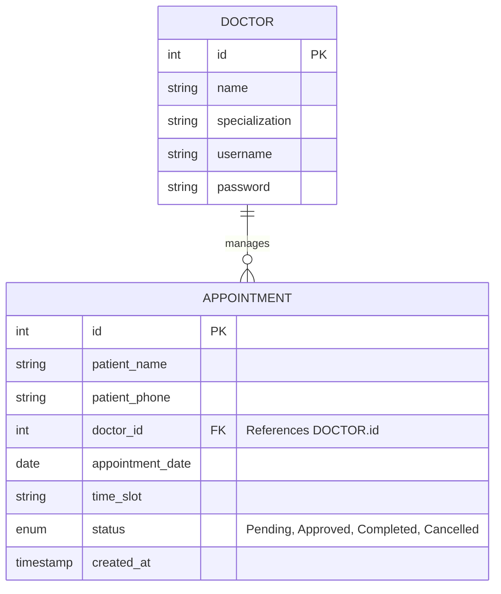

# Project ER Diagram

Below is the Entity-Relationship (ER) diagram for your Appointment Booking System, visualizing the connections between doctors and appointments.

### Key Components

*   **Doctor Entity**: Stores professional details and login credentials for medical staff.
*   **Appointment Entity**: Captures patient details, scheduled time, and its link to a specific doctor.
*   **Relationship**: A **one-to-many (1:N)** relationship exists from `Doctors` to `Appointments`, as one doctor can manage multiple patient bookings.
